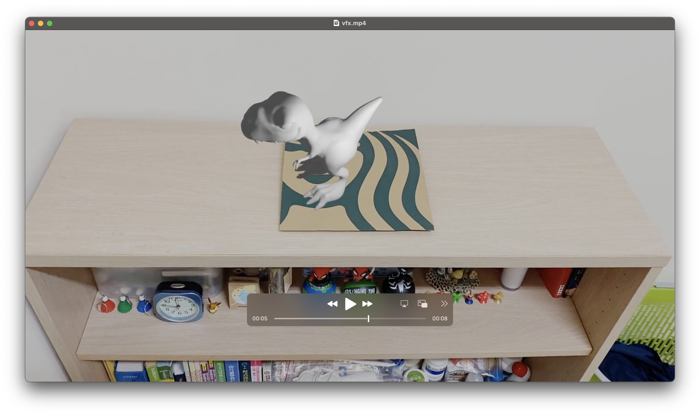

# NTU_VFX

These are the homework assignments for the NTU 2022 Spring Digital Visual Effects course.

## HW1: High Dynamic Range Imaging
- Project description: [link](https://www.csie.ntu.edu.tw/~cyy/courses/vfx/22spring/assignments/proj1/)

## HW2: Image Stitching
- Project description: [link](https://www.csie.ntu.edu.tw/~cyy/courses/vfx/22spring/assignments/proj2/)

## HW3: MatchMove
- Project description: [link](https://www.csie.ntu.edu.tw/~cyy/courses/vfx/22spring/assignments/proj3/)

## Final Project
- Project description: [link](https://www.csie.ntu.edu.tw/~cyy/courses/vfx/22spring/assignments/final/)