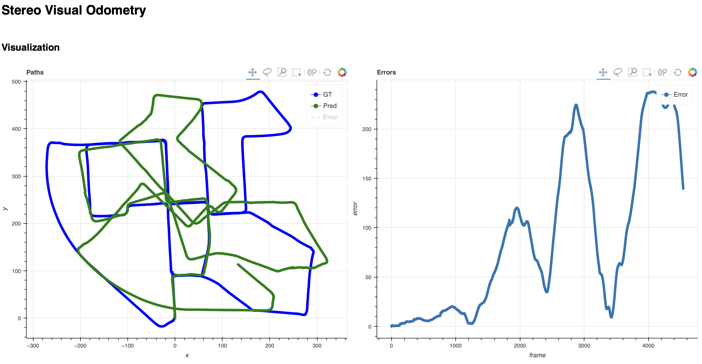

# Stereo Visual Odometry

## Introduction

- In KITTI dataset, the input images are already corrected for lens distortion and stereo rectified.
- Computed output is the actual motion (on scale).

## Algorithm

1. Input image sequence
2. Feature detection
3. Feature tracking
4. 3D point clouds generation
5. Inlier detection
6. Motion estimation

## Visualization

## Reference

1. https://github.com/cgarg92/Stereo-visual-odometry
1. http://www.cvlibs.net/datasets/kitti/eval_odometry.php